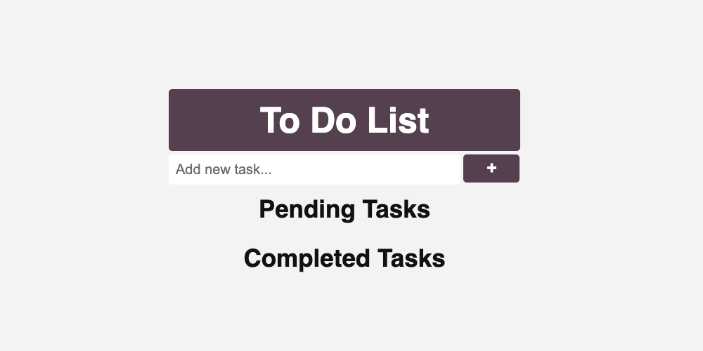
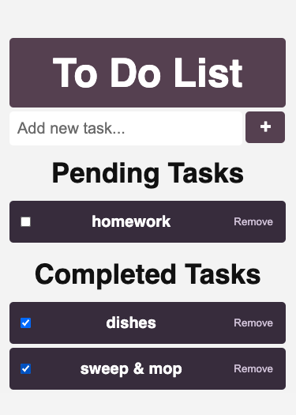

# TO Do List

The assignment was to creat a To Do List that would look good on mobile devices, allowed adding and removing tasks, and allowed the user to move and item from pending to complete and vice versa *(see below)*. 

## Screenshots

In order to make it mobile friendly, I had to add a media query for devices with a max-width of 599px.The only things that were changed within the media query was the top padding, the size of the input box and the size of the add button. 

